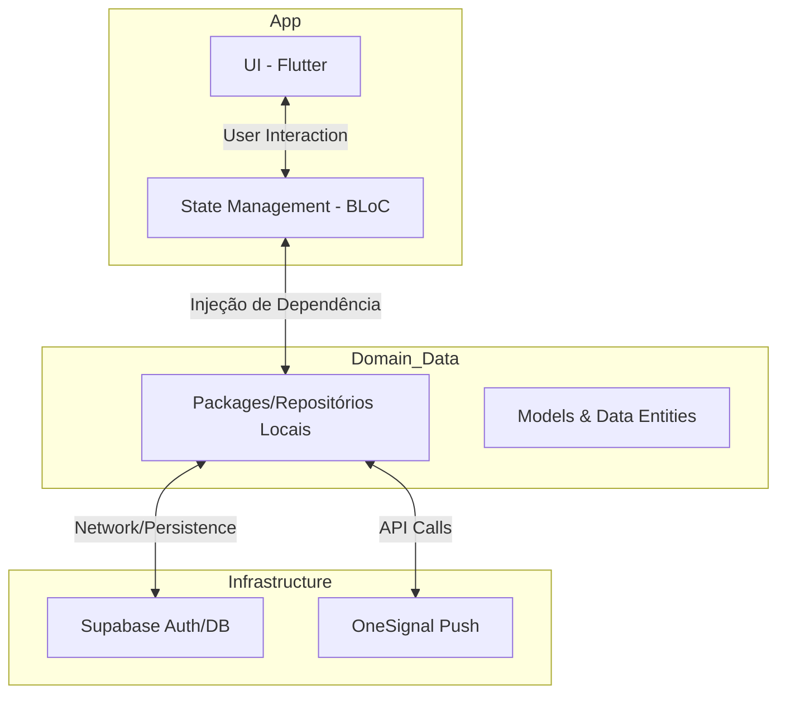

# ⛪ Clubinho Bíblico App
> Uma plataforma robusta e escalável para gestão de atividades infantis e escalas ministeriais.

---

## 🌟 Visão Geral

O **Clubinho Bíblico** é uma solução completa desenvolvida para facilitar a gestão de ministérios infantis. Com foco em **automação**, **multi-tenant** e **experiência do usuário (UX)**, o aplicativo permite que líderes, coordenadores e professores gerenciem escalas, gerem relatórios em PDF e mantenham a comunicação ativa através de notificações push em tempo real.

Este projeto foi construído seguindo os mais altos padrões de desenvolvimento de software, garantindo manutenibilidade e escalabilidade para o crescimento do ministério.

---

## 🚀 Funcionalidades Principais

| Funcionalidade | Descrição |
| :--- | :--- |
| **Escalas Inteligentes** | Criação de roteiros com blocos dinâmicos (Música, Atividades, Orações) com geração de PDF automático. |
| **Dashboard de Estatísticas** | Visualização analítica de presenças, crescimento e engajamento dos últimos 3 meses. |
| **Notificações em Tempo Real** | Alertas In-App e Push via **OneSignal** integrados para escalas futuras. |
| **Cartões de Decisão** | Registro de decisões das crianças com layouts personalizados exportáveis em PDF. |
| **Multi-tenancy** | Sistema robusto onde cada "Clubinho" é isolado, garantindo privacidade e controle de dados. |
| **Gestão de Equipe** | Controle de acesso baseado em Roles (Admin vs. Professor) e gerenciamento de permissões. |

---

## 🛠️ Stack Tecnológica

### Frontend (Mobile & Tablet)
- **Flutter & Dart**: Interface reativa e de alta performance.
- **BLoC (Business Logic Component)**: Gestão de estado previsível e desacoplada.
- **Flutter ScreenUtil**: Layout responsivo para múltiplos dispositivos.
- **GoRouter**: Sistema de navegação profissional e seguro.

### Backend & Infraestrutura
- **Supabase**: Backend-as-a-Service (BaaS) moderno.
- **PostgreSQL**: Banco de dados relacional robusto.
- **RLS (Row Level Security)**: Segurança de dados a nível de linha por clubinho.
- **OneSignal**: Infraestrutura de notificações push global.
- **Database Triggers**: Automação de lógica de negócio diretamente no servidor.

---

## 🏗️ Arquitetura de Software

O projeto utiliza **Clean Architecture** com foco em separação de preocupações, utilizando pacotes locais isolados para cada repositório.

---

## 💎 Diferenciais de Desenvolvimento

- **Padrão de Repositórios**: Toda a comunicação com APIs é feita via pacotes Flutter independentes dentro de `packages/`, facilitando testes unitários e trocas de provedores.
- **Segurança Senior**: Implementação rigorosa de RLS no Supabase, garantindo que usuários nunca acessem dados de outros clubes.
- **Design System**: Uso de tema personalizado e componentes globais para consistência visual.
- **CI/CD Friendly**: Estrutura organizada pronta para pipelines de automação.

---

## 👨‍💻 Contato e Freelance

Este projeto demonstra minha capacidade de entregar produtos de ponta a ponta, desde a arquitetura de banco de dados até a experiência final do usuário.

**Interessado em escalar seu projeto ou contratar um serviço premium?**
-   📧 **Email**: gfelix.developer@gmail.com
-   💼 **LinkedIn**: [[Clique Aqui]](http://www.linkedin.com/in/gfelix-developer)

---

  Criado com ❤️ por Felix

